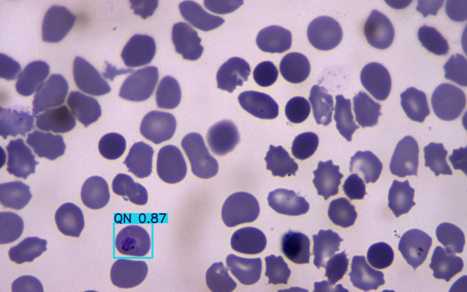

# MorphoTreat

### Morphology-Based Treatment Identification

**MorphoTreat** is an R package for identifying antimalarial drug
treatments based on the blood stage morphology of *P. falciparum*.\
It uses **YOLO Object Detection** to analyze input images and predict
the presence of malaria stages.


------------------------------------------------------------------------

## **📌 Prerequisites**

Since **MorphoTreat** relies on **YOLO CLI**, you need to install
`ultralytics` and ensure YOLO CLI is accessible.

Please follow this link for detailed installation instructions.

🔗 [Official YOLO Installation
Guide](https://docs.ultralytics.com/quickstart/)

## **🔹 Installation**

### **1. Install from Source**

You can install **MorphoTreat** from your local repository:

``` r
devtools::install_github("slphyx/MorphoTreat")
```

or if you have the package built as a `.tar.gz` file:

``` r
install.packages("MorphoTreat_0.0.1.tar.gz", repos = NULL, type = "source")
```

### **2. Load the Package**

``` r
library(MorphoTreat)
```

------------------------------------------------------------------------

## **🔹 Functions**

### **MorphoPredict()**

Performs YOLO-based detection on an input image and **displays the
result immediately**.

**Usage:**

``` r
MorphoPredict(img.path = "path/to/image.jpg")
```

#### **Example:**

``` r
MorphoPredict(img.path = "inst/sample_images/malaria_sample.jpg")
```



------------------------------------------------------------------------
